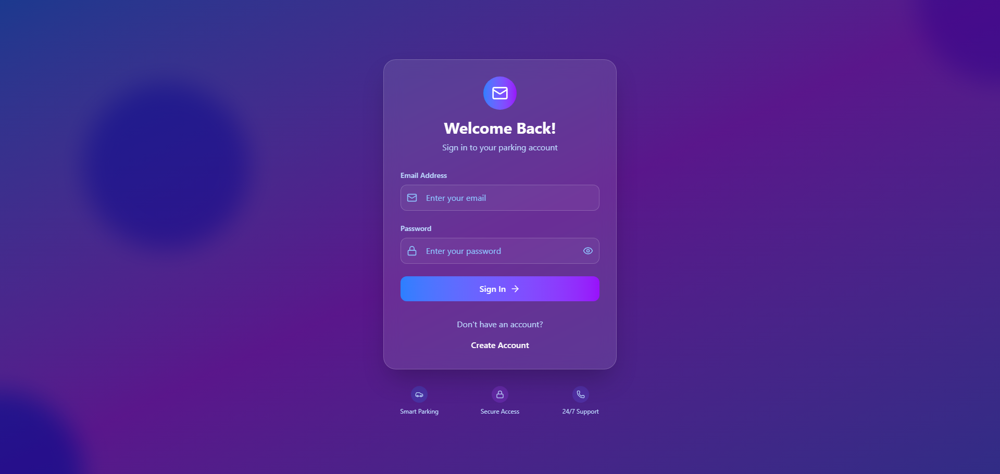
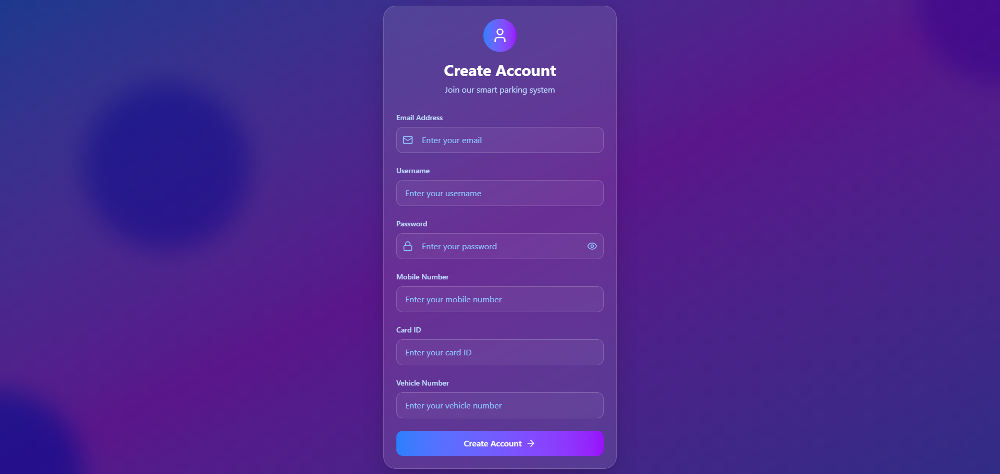

# 🚗 Smart Parking Management System

  
*A comprehensive IoT-based parking management solution built with **Arduino ESP8266**, **Node.js**, **MongoDB**, and **React**. The system enables real-time parking space monitoring, automated barrier control, RFID-based access, and a web-based dashboard for analytics and control.*

---

## 📋 Table of Contents

- [Features](#-features)  
- [System Architecture](#-system-architecture)  
- [Hardware Requirements](#-hardware-requirements)  
- [Software Requirements](#-software-requirements)  
- [Installation](#-installation)  
- [Configuration](#-configuration)  
- [Usage](#-usage)  
- [API Documentation](#-api-documentation)  
- [Web Interface](#-web-interface)  
- [Images](#-images)  
- [Troubleshooting](#-troubleshooting)  
- [Contributing](#-contributing)  
- [Acknowledgments](#-acknowledgments)  
- [Support](#-support)  
- [Version History](#-version-history)  
- [License](#-license)  

---

## ✨ Features

### 🔧 Arduino/Hardware
- Real-time parking monitoring (Ultrasonic + IR sensors)  
- Automated barrier control with servo motor  
- RFID authentication for vehicles  
- LCD display for space availability and system status  
- Audio alerts via buzzer  
- LED indicators (green/red) for permissions  
- ESP8266 WiFi for remote connectivity  
- WebSocket communication for live updates  

### 💻 Backend/Software
- Node.js backend with REST + WebSocket APIs  
- MongoDB database integration via Mongoose  
- Real-time dashboards with React.js  
- Logging of vehicle sessions & analytics  
- Admin & user roles (different dashboards)  
- Auto-reconnect and fail-safe handling  
- Historical parking session tracking  

---

## 🏗 System Architecture

### Block Diagram


**Flow:**
1. Sensors (Ultrasonic/IR + RFID) detect vehicles and users  
2. NodeMCU (ESP8266) processes signals and controls servo barrier  
3. Node.js backend manages data + communicates with ESP8266 via WebSocket  
4. MongoDB stores user, slot, and session data  
5. React frontend displays real-time dashboards for users/admin  

---

## 🔧 Hardware Requirements

- ESP8266 (NodeMCU/Wemos D1 Mini)  
- 5× IR/Ultrasonic sensors  
- RFID reader (RC522)  
- Servo motor (SG90)  
- LCD (I2C interface)  
- Buzzer + LEDs (green/red)  
- Breadboard + jumper wires  
- 5V power supply  

**Pin Mapping (example):**
```
D1 (GPIO5)  → Servo Motor  
D0 (GPIO16) → Buzzer  
D7 (GPIO13) → Green LED  
D8 (GPIO15) → Red LED  
D6 (GPIO12) → Entry IR Sensor  
D5 (GPIO14) → Exit IR Sensor  
D4 (GPIO2)  → Space 1 Sensor  
D2 (GPIO4)  → Space 2 Sensor  
D3 (GPIO0)  → Space 3 Sensor  
RX (GPIO3)  → Space 4 Sensor  
TX (GPIO1)  → Space 5 Sensor  
D1/D2       → I2C SDA/SCL (LCD)  
```

---

## 💻 Software Requirements

### Arduino IDE
- ESP8266 board package  
- Libraries: `ArduinoWebsockets`, `ESP8266WiFi`, `ArduinoJson`, `LiquidCrystal_I2C`, `Servo`, `Wire`  

### Backend
- Node.js 14+  
- npm 6+  
- MongoDB database  

### Frontend
- React.js (Vite or CRA)  
- Axios for API calls  
- react-use-websocket for real-time updates  

---

## 🚀 Installation

### 1. Clone Repository
```bash
git clone https://github.com/yourusername/smart-parking-system.git
cd smart-parking-system
```

### 2. Backend Setup
```bash
cd backend
npm install
npm start
```

### 3. Arduino Setup
- Open `VehicleParking.ino` in Arduino IDE  
- Configure WiFi + server IP in code  
- Upload to ESP8266  

### 4. Frontend Setup
```bash
cd frontend
npm install
npm run dev
```

---

## ⚙️ Configuration

**Arduino**
```cpp
const char* ssid = "YOUR_WIFI";
const char* password = "YOUR_PASS";
const char* websocket_server = "ws://192.168.1.100:3000";
#define TOTAL_SPACES 5
```

**Backend**
```js
const PORT = 3000;
let parkingData = { totalSpaces: 5 };
```

---

## 📖 Usage

1. Start backend: `npm start`  
2. Flash ESP8266 firmware  
3. Run frontend: `npm run dev`  
4. Visit `http://localhost:5173`  
5. Monitor live occupancy + manage sessions  

---

## 📡 API Documentation

**WebSocket Events**
```json
// Arduino → Server
{ "type": "status_update", "available_spaces": 3 }

// Server → Arduino
{ "command": "open_barrier" }
```

**REST Endpoints**
- `GET /api/status` → system status  
- `GET /api/events` → recent logs  
- `POST /api/command` → control barrier  

---

## 🖥 Web Interface

- Real-time slots monitoring  
- Admin & User dashboards  
- Manual barrier controls  
- RFID logs & vehicle sessions  
- Analytics & history  

---

## 🖼 Imagess
### Login Page

### SignUp Page

### User dashboard Page

### Admin dashboard Page


---

## 🐛 Troubleshooting
- WiFi not connecting → check SSID/pass & 2.4GHz  
- WebSocket errors → check backend IP + port  
- Sensors misbehaving → test individually  
- Servo stuck → check power (use 5V)  

---

## 🤝 Contributing
- Fork repo  
- Create feature branch  
- Commit changes & PR  

---

## 🙏 Acknowledgments
- Arduino & ESP8266 communities  
- Node.js + React ecosystem  
- MongoDB + Mongoose contributors  

---

## 📞 Support
- GitHub Issues for bugs  
- Discussions for Q&A  
- Email: `marioshehan025@gmail.com`  

---

## 🔄 Version History
- v1.0.0 → Initial prototype  
- v1.1.0 → Added dashboard + REST API  
- v1.2.0 → Improved error handling  
- v1.3.0 → Added RFID + analytics  

---

## 📜 License
The **Smart Parking Management System** (ESP8266 + Node.js + React + MongoDB) is licensed under the **MIT License**.  

✅ Free to use, modify, and distribute  
ℹ️ Attribution required  
📄 See [LICENSE](LICENSE) file for details  
