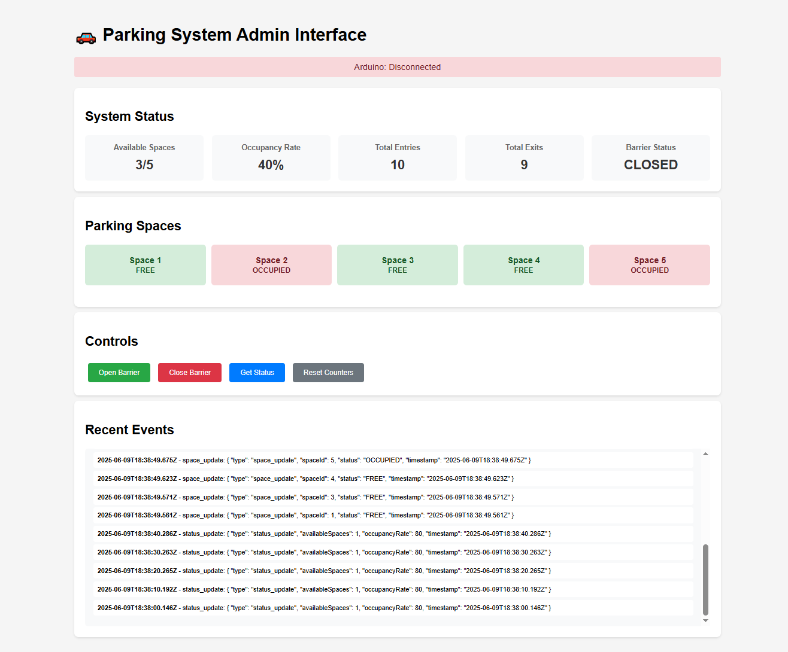
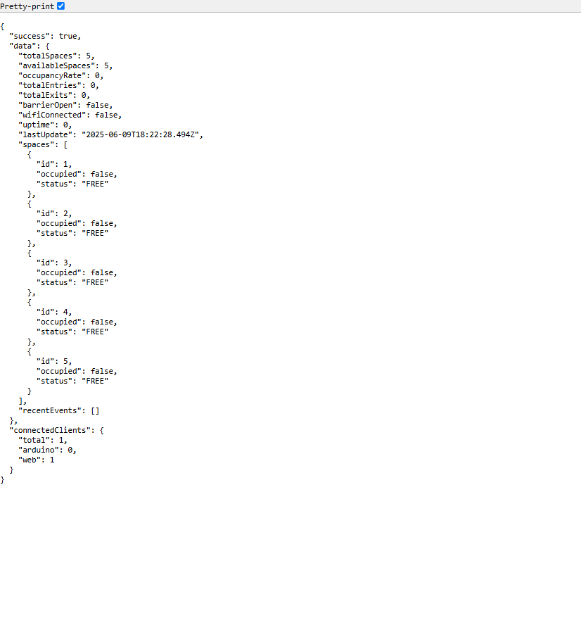

# 🚗 Smart Parking Management System

A comprehensive IoT-based parking management system built with **Arduino ESP8266** and **Node.js**. This system provides real-time parking space monitoring, automated barrier control, and a web-based dashboard for management and analytics.

## 📋 Table of Contents

- [Features](#features)
- [System Architecture](#system-architecture)
- [Hardware Requirements](#hardware-requirements)
- [Software Requirements](#software-requirements)
- [Installation](#installation)
- [Configuration](#configuration)
- [Usage](#usage)
- [API Documentation](#api-documentation)
- [Web Interface](#web-interface)
- [Troubleshooting](#troubleshooting)
- [Contributing](#contributing)
- [License](#license)

## ✨ Features

### Arduino/Hardware Features
- **Real-time parking space monitoring** using IR sensors
- **Automated barrier control** with servo motor
- **Vehicle entry/exit detection** at gates
- **LCD display** showing available spaces and system status
- **Audio notifications** with buzzer for different events
- **LED indicators** (Green/Red) for entry permissions
- **WiFi connectivity** for remote monitoring
- **WebSocket communication** for real-time updates

### Backend/Software Features
- **Real-time web dashboard** with live updates
- **RESTful API** for system integration
- **Event logging** and analytics
- **Remote barrier control** via web interface
- **Multi-client WebSocket support**
- **Automatic reconnection** handling
- **Historical data** tracking

## 🏗️ System Architecture

```
┌─────────────────┐    WebSocket    ┌─────────────────┐    HTTP/WS    ┌─────────────────┐
│ Arduino ESP8266 │ ◄──────────►    │  Node.js Server │ ◄──────────►  │   Web Dashboard │
│                 │                 │                 │               │                 │
│ • IR Sensors    │                 │ • WebSocket Hub │               │ • Real-time Data│
│ • Servo Motor   │                 │ • REST API      │               │ • Controls      │
│ • LCD Display   │                 │ • Event Logger  │               │ • Analytics     │
│ • WiFi Module   │                 │ • Data Storage  │               │ • Event Logs    │
└─────────────────┘                 └─────────────────┘               └─────────────────┘
```

## 🔧 Hardware Requirements

### Essential Components
- **ESP8266 Development Board** (NodeMCU/Wemos D1 Mini)
- **5x IR Proximity Sensors** (for parking spaces)
- **2x IR Sensors** (entry/exit detection)
- **Servo Motor SG90** (barrier control)
- **16x2 LCD Display with I2C Module**
- **Buzzer** (active/passive)
- **2x LEDs** (Green & Red)
- **Resistors** (220Ω for LEDs)
- **Breadboard and Jumper Wires**
- **Power Supply** (5V/3.3V)

### Pin Configuration
```
ESP8266 Pin  │ Component
─────────────┼──────────────────
D1 (GPIO5)   │ Servo Motor
D0 (GPIO16)  │ Buzzer
D7 (GPIO13)  │ Green LED
D8 (GPIO15)  │ Red LED
D6 (GPIO12)  │ Entry IR Sensor
D5 (GPIO14)  │ Exit IR Sensor
D4 (GPIO2)   │ Space 1 IR Sensor
D2 (GPIO4)   │ Space 2 IR Sensor
D3 (GPIO0)   │ Space 3 IR Sensor
RX (GPIO3)   │ Space 4 IR Sensor
TX (GPIO1)   │ Space 5 IR Sensor
D1 (GPIO5)   │ I2C SDA (LCD)
D2 (GPIO4)   │ I2C SCL (LCD)
```

## 💻 Software Requirements

### Arduino IDE Setup
- **Arduino IDE** 1.8.0 or higher
- **ESP8266 Board Package** 3.0.0+
- **Required Libraries:**
  - `ArduinoWebsockets` by Gil Maimon
  - `ESP8266WiFi` (built-in)
  - `ArduinoJson` by Benoit Blanchon
  - `LiquidCrystal_I2C` by Frank de Brabander
  - `Servo` (built-in)
  - `Wire` (built-in)

### Backend Requirements
- **Node.js** 14.0.0 or higher
- **npm** 6.0.0 or higher

## 🚀 Installation

### 1. Clone Repository
```bash
git clone https://github.com/yourusername/smart-parking-system.git
cd smart-parking-system
```

### 2. Backend Setup
```bash
# Navigate to backend directory
cd backend

# Install dependencies
npm install

# Start the server
npm start
```

### 3. Arduino Setup
```bash
# Install Arduino IDE libraries
# Tools → Manage Libraries → Search and install:
# - ArduinoWebsockets
# - ArduinoJson
# - LiquidCrystal_I2C
```

### 4. Hardware Assembly
1. Connect components according to pin configuration
2. Ensure proper power supply (5V recommended)
3. Test individual sensors before final assembly

## ⚙️ Configuration

### Arduino Configuration
Edit these variables in the Arduino code:

```cpp
// WiFi Configuration
const char* ssid = "YOUR_WIFI_SSID";
const char* password = "YOUR_WIFI_PASSWORD";

// WebSocket Server (Replace with your computer's IP)
const char* websocket_server = "ws://192.168.1.100:3000";

// Parking Configuration
#define TOTAL_SPACES    5
#define BARRIER_OPEN_TIME 5000  // milliseconds
```

### Backend Configuration
Edit configuration in `parking-system-backend.js`:

```javascript
// Server Configuration
const PORT = 3000;

// Parking Configuration (should match Arduino)
let parkingData = {
  totalSpaces: 5,
  // ... other settings
};
```
## Images



## 📖 Usage

### Starting the System

1. **Start Backend Server:**
   ```bash
   npm start
   ```
   Server will start at: `http://localhost:3000`

2. **Upload Arduino Code:**
   - Open Arduino IDE
   - Select correct board and port
   - Upload the code to ESP8266

3. **Access Web Dashboard:**
   - Open browser: `http://localhost:3000`
   - Monitor real-time parking data
   - Use control buttons for testing

### System Operation

#### Normal Operation Flow:
1. **Vehicle Approaches Entry** → IR sensor detects → Check available spaces
2. **Spaces Available** → Barrier opens → Green LED → Success sound
3. **No Spaces** → Barrier stays closed → Red LED → Error sound
4. **Vehicle Parks** → Space IR sensor detects → Update counter
5. **Vehicle Exits** → Exit IR sensor detects → Barrier opens → Update counter

#### Web Dashboard Features:
- **Real-time Status**: Available spaces, occupancy rate
- **Space Visualization**: Green (free) / Red (occupied) grid
- **Manual Controls**: Open/close barrier, reset counters
- **Event Monitoring**: Live log of all system events
- **System Health**: Connection status, uptime, error logs

## 📡 API Documentation

### WebSocket Events

#### From Arduino to Server:
```javascript
// Status Update
{
  "type": "status_update",
  "available_spaces": 3,
  "total_spaces": 5,
  "occupancy_rate": 40,
  "total_entries": 15,
  "total_exits": 12,
  "barrier_open": false,
  "spaces": [...]
}

// Vehicle Entry
{
  "type": "vehicle_entry",
  "entry_allowed": true,
  "available_spaces": 2,
  "total_entries": 16
}
```

#### From Server to Arduino:
```javascript
// Control Commands
{
  "command": "open_barrier"
}
{
  "command": "close_barrier"
}
{
  "command": "get_status"
}
{
  "command": "reset_counters"
}
```

### REST API Endpoints

#### GET `/api/status`
Returns current parking system status.

**Response:**
```json
{
  "success": true,
  "data": {
    "availableSpaces": 3,
    "totalSpaces": 5,
    "occupancyRate": 40,
    "totalEntries": 15,
    "totalExits": 12,
    "barrierOpen": false,
    "spaces": [...]
  },
  "connectedClients": {
    "total": 2,
    "arduino": 1,
    "web": 1
  }
}
```

#### GET `/api/events?limit=20`
Returns recent system events.

**Response:**
```json
{
  "success": true,
  "events": [
    {
      "type": "vehicle_entry",
      "timestamp": "2024-01-15T10:30:00.000Z",
      "entryAllowed": true,
      "availableSpaces": 2
    }
  ]
}
```

#### POST `/api/command`
Send command to Arduino system.

**Request Body:**
```json
{
  "command": "open_barrier",
  "payload": {}
}
```

**Response:**
```json
{
  "success": true,
  "message": "Command 'open_barrier' sent to Arduino"
}
```

## 🖥️ Web Interface

### Dashboard Features

#### Status Overview
- **Available Spaces**: Real-time count with total capacity
- **Occupancy Rate**: Percentage with visual indicator
- **Entry/Exit Counters**: Total vehicles processed
- **Barrier Status**: Current position (OPEN/CLOSED)
- **Connection Status**: Arduino connectivity indicator

#### Parking Space Grid
- **Visual Layout**: 5 parking spaces in grid format
- **Color Coding**: 
  - 🟢 Green = Available space
  - 🔴 Red = Occupied space
- **Real-time Updates**: Instant status changes

#### Control Panel
- **Open Barrier**: Manual barrier control
- **Close Barrier**: Emergency barrier close
- **Get Status**: Force status refresh
- **Reset Counters**: Clear entry/exit counts

#### Event Monitor
- **Live Event Log**: Real-time system events
- **Timestamps**: Precise event timing
- **Event Types**: Entry, exit, space changes, errors
- **Auto-scroll**: Latest events at top

## 🐛 Troubleshooting

### Common Issues

#### Arduino Connection Issues
```
Problem: Arduino not connecting to WiFi
Solution: 
- Check SSID and password
- Ensure 2.4GHz WiFi network
- Check signal strength
- Verify ESP8266 power supply
```

#### WebSocket Connection Failed
```
Problem: Arduino can't connect to server
Solution:
- Verify server IP address in Arduino code
- Check if server is running (npm start)
- Ensure firewall allows port 3000
- Test with ping command
```

#### Sensor Reading Issues
```
Problem: IR sensors not detecting properly
Solution:
- Check sensor wiring and power
- Adjust sensor sensitivity
- Verify pin assignments
- Test sensors individually
```

#### Barrier Motor Problems
```
Problem: Servo motor not responding
Solution:
- Check servo power supply (5V recommended)
- Verify PWM signal on servo pin
- Test servo with manual commands
- Check servo horn alignment
```

### Debug Commands

#### Arduino Serial Monitor
```cpp
// Enable debug output
Serial.begin(115200);
Serial.println("Debug message");
```

#### Server Logs
```bash
# Start server with verbose logging
DEBUG=* npm start

# Check specific component
DEBUG=websocket npm start
```

### Performance Optimization

#### Arduino Memory Management
- Use `F()` macro for string constants
- Minimize global variables
- Optimize JSON message sizes
- Handle memory leaks in loops

#### Network Optimization
- Implement connection pooling
- Add message queuing for reliability
- Use compression for large payloads
- Implement heartbeat mechanism

## 🤝 Contributing

We welcome contributions! Please follow these steps:

1. **Fork the Repository**
2. **Create Feature Branch**: `git checkout -b feature/AmazingFeature`
3. **Commit Changes**: `git commit -m 'Add AmazingFeature'`
4. **Push to Branch**: `git push origin feature/AmazingFeature`
5. **Open Pull Request**

### Development Guidelines
- Follow existing code style
- Add comments for complex logic
- Test thoroughly before submitting
- Update documentation as needed

### Reporting Issues
Please include:
- System specifications
- Arduino/Node.js versions
- Detailed error messages
- Steps to reproduce
- Expected vs actual behavior

## 📄 License

This project is licensed under the MIT License - see the [LICENSE](LICENSE) file for details.

## 🙏 Acknowledgments

- **Arduino Community** for extensive documentation
- **ESP8266 Developers** for the excellent WiFi capabilities
- **Node.js WebSocket Libraries** for reliable communication
- **Contributors** who helped improve this project

## 📞 Support

- **Documentation**: Check this README and inline code comments
- **Issues**: Use GitHub Issues for bug reports
- **Discussions**: Use GitHub Discussions for questions
- **Email**: your.email@example.com

## 🔄 Version History

- **v1.0.0** - Initial release with basic functionality
- **v1.1.0** - Added web dashboard and REST API
- **v1.2.0** - Enhanced error handling and reconnection
- **v1.3.0** - Added event logging and analytics

---

**Made with ❤️ for the IoT and Arduino community**

*If you find this project helpful, please consider giving it a ⭐ on GitHub!*

## 📜 License

This project is licensed under the **MIT License** — see the [LICENSE](LICENSE) file for details.


